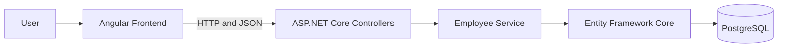

# StackFlow

StackFlow is a full-stack employee management system for maintaining an organization's employee directory. It demonstrates CRUD operations, form validation, REST API communication, database persistence, filtering, automated tests, and responsive user-interface design.

## Features

- Dashboard with total, active, inactive, and department statistics
- Employee list with loading, empty, and error states
- Search by name, email, or job title
- Filter by department
- View complete employee details
- Add, edit, and delete employees
- Browser confirmation before deletion
- Client-side and server-side validation
- Responsive desktop-first interface
- Backend and frontend automated tests
- Manual test-case checklist

## Tech Stack

### Frontend

- Angular 22
- TypeScript 6
- Angular Router
- HttpClient
- Reactive Forms
- CSS
- Vitest

### Backend

- .NET 10
- C#
- ASP.NET Core Web API
- Entity Framework Core
- Npgsql PostgreSQL provider
- xUnit

### Database

- PostgreSQL 17

## Architecture



The frontend displays the interface and sends HTTP requests. The controller accepts those requests and returns appropriate HTTP responses. The service contains employee operations, Entity Framework Core translates them into SQL, and PostgreSQL stores the data.

## Project Structure

```text
Stackflow/
├── stackflow-api/
│   ├── Controllers/        # REST API endpoints
│   ├── Data/               # EF Core DbContext and design-time factory
│   ├── DTOs/               # API request and response models
│   ├── Migrations/         # Database schema history
│   ├── Models/             # Database entities
│   ├── Services/           # Employee business operations
│   └── Program.cs          # Backend startup and dependency configuration
├── stackflow-api.Tests/    # xUnit backend tests
├── stackflow-frontend/
│   └── src/app/
│       ├── components/     # Dashboard and employee pages
│       ├── models/         # TypeScript employee types
│       └── services/       # HttpClient API communication
├── docs/
│   └── test-cases.md       # Manual testing checklist
├── .gitignore
└── README.md
```

## Prerequisites

- .NET SDK 10
- Node.js 24 and npm
- Angular CLI 22
- PostgreSQL 17
- EF Core command-line tools
- Git

Confirm the main tools are available:

```bash
dotnet --version
node --version
npm --version
ng version
psql --version
dotnet ef --version
```

## PostgreSQL Setup

Start PostgreSQL and confirm it is accepting connections:

```bash
brew services start postgresql@17
pg_isready
```

Create the development database if it does not already exist:

```bash
createdb stackflow_db
psql -d stackflow_db -c "SELECT current_database();"
```

## Backend Setup

Move into the backend directory and restore dependencies:

```bash
cd stackflow-api
dotnet restore
```

Store the local PostgreSQL connection string in .NET User Secrets:

```bash
dotnet user-secrets set "ConnectionStrings:DefaultConnection" "Host=localhost;Port=5432;Database=stackflow_db;Username=YOUR_POSTGRES_USERNAME"
```

Replace `YOUR_POSTGRES_USERNAME` with your local PostgreSQL username. Do not place real credentials in `appsettings.json` or commit them to Git.

Confirm the secret key exists:

```bash
dotnet user-secrets list
```

## Database Migration

Apply the existing EF Core migration:

```bash
dotnet ef database update
```

This creates the `Employees` table and EF Core migration-history table in `stackflow_db`.

## Running the Backend

From `stackflow-api`, run:

```bash
dotnet run --launch-profile http --urls http://localhost:5090
```

The launch profile sets `ASPNETCORE_ENVIRONMENT=Development`, allowing .NET User Secrets to load. The API is available at `http://localhost:5090`.

## Frontend Setup

Open another terminal, install dependencies, and start Angular:

```bash
cd stackflow-frontend
npm install
npm start
```

Open `http://localhost:4200`. The backend must remain running while the frontend is used.

## API Endpoints

| Method | Endpoint | Purpose | Successful status |
|---|---|---|---|
| GET | `/api/employees` | Get all employees | `200 OK` |
| GET | `/api/employees/{id}` | Get one employee | `200 OK` |
| GET | `/api/employees?search=kushal` | Search employees | `200 OK` |
| GET | `/api/employees?department=Engineering` | Filter by department | `200 OK` |
| POST | `/api/employees` | Create an employee | `201 Created` |
| PUT | `/api/employees/{id}` | Update an employee | `204 No Content` |
| DELETE | `/api/employees/{id}` | Delete an employee | `204 No Content` |

Common error responses include `400 Bad Request` for invalid input and `404 Not Found` when an employee does not exist.

## Employee Data

Each employee contains an ID, name, email, phone, department, job title, salary, date of joining, and active status.

## Testing

### Backend tests

Run from the repository root:

```bash
dotnet test stackflow-api.Tests/stackflow-api.Tests.csproj
```

The backend suite checks DTO validation, controller status codes, CRUD behavior, search, and department filtering.

### Frontend tests

Run from `stackflow-frontend`:

```bash
npm test -- --watch=false
```

The frontend suite checks application components, HTTP service methods, form validation, and employee-list initialization.

### Production build

Run from `stackflow-frontend`:

```bash
npm run build
```

Generated files are written under `stackflow-frontend/dist/` and are excluded from Git.

### Manual testing

Follow [docs/test-cases.md](docs/test-cases.md) and record the actual result and status for each scenario.

## Screenshots

Add current screenshots to `docs/screenshots/` before presenting or publishing the project. Recommended screenshots include the dashboard, employee list and filters, employee form, employee details, and validation messages.

## GitHub Setup

After creating an empty GitHub repository, connect the local repository using the URL GitHub provides:

```bash
git remote add origin YOUR_GITHUB_REPOSITORY_URL
git branch -M main
git push -u origin main
```

Review staged files before every commit and confirm that connection strings, passwords, `node_modules`, `bin`, `obj`, and build output are not included.

## Troubleshooting

### Connection string was not found

Confirm the secret exists and start the API with the Development launch profile:

```bash
cd stackflow-api
dotnet user-secrets list
dotnet run --launch-profile http --urls http://localhost:5090
```

### PostgreSQL is unavailable

```bash
brew services restart postgresql@17
pg_isready
```

### Angular cannot reach the API

Confirm that the API is listening on `http://localhost:5090`, Angular is running on `http://localhost:4200`, and the backend CORS policy allows the Angular origin.

### NuGet warning NU1900

`NU1900` means .NET could not download NuGet vulnerability metadata. Check the network, certificate configuration, and access to `https://api.nuget.org/v3/index.json`. It does not automatically mean the project failed to compile.

## Learning Outcomes

This project demonstrates how to:

- Structure an Angular and ASP.NET Core application
- Design RESTful CRUD endpoints
- Use DTOs and dependency injection
- Validate input in the browser and API
- Use Angular Reactive Forms and HttpClient
- Map C# entities to PostgreSQL with EF Core
- Create and apply database migrations
- Handle loading, empty, success, and error states
- Write backend and frontend automated tests
- Keep development secrets out of Git

## Future Enhancements

Possible Version 2 features include authentication, user roles, pagination, sorting, attendance, leave management, payroll, projects, reporting, Docker support, and deployment.

These features are intentionally outside Version 1 so the current project remains focused on CRUD, REST APIs, Angular, .NET, and PostgreSQL fundamentals.
